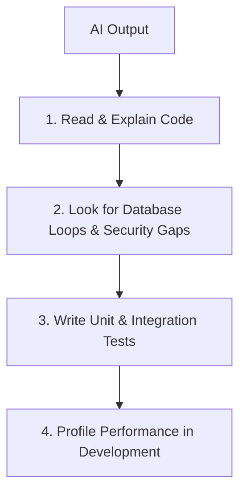

# How I Collaborate with AI

This document establishes my framework for working with Large Language Models (LLMs). As a student developer, AI is an invaluable learning accelerator and coding partner, but using it safely requires a structured set of validation rules.

---

## My Rules for AI-Generated Code

I enforce four strict rules when using code generated by an AI:

1.  **I must be able to explain the code line-by-line**: If I cannot explain the execution path or the parameters of a generated method, I do not merge it.
2.  **No direct copy-pasting**: I manually type or rewrite generated code blocks into my editor. This forces me to read every line, review formatting, and verify dependencies.
3.  **Tests must be written manually**: I do not let AI write both the implementation *and* the tests. If the AI writes the code, I write the tests to verify its correctness.
4.  **No secrets in prompts**: I never paste API keys, JWT secrets, database connection strings, or production configuration properties into external AI interfaces.

---

## How I Use AI as a Junior Developer

*   **Interactive Tutor**: When learning new patterns (like Entity Framework Core tracking states), I ask the AI to explain the underlying mechanics: *"How does the EF Core change tracker determine state modifications under the hood? Walk me through it step-by-step."*
*   **Boilerplate Generator**: I use AI to write repetitive, low-risk code, such as DTO mappers, regular expressions, and CSS styling layouts.
*   **Syntax Translation**: When translating logic between languages (e.g., converting a Python script into a C# utility), I use AI to map syntax differences.

---

## Mistakes AI Helped Me Catch

*   **Missing Resource Cleanups**: In **RepoLens**, an AI helper pointed out that my Git repository stream reader was not disposed during execution anomalies, which would have leaked system file handles.
*   **Boundary Validation Gaps**: When writing validation schemas, the AI flagged that I was not validating maximum character constraints on inputs, leaving the system vulnerable to buffer bloat attacks.
*   **Edge Case Null Handling**: AI code reviews regularly identify variables that could be null under abnormal API inputs, allowing me to add safe guard clauses.

---

## Mistakes AI Introduced (and How I Caught Them)

### 1. The N+1 Query Bottleneck
*   **What the AI generated**: A clean-looking C# method to retrieve repositories and count their commits.
*   **The bug**: The AI wrote a loop that queried PostgreSQL for every repository:
    ```csharp
    foreach (var repo in repositories) {
        var count = _context.Commits.Count(c => c.RepositoryId == repo.Id); // N queries
    }
    ```
*   **How I caught it**: I noticed high database response latencies in my local logs, and ran `EXPLAIN ANALYZE` on the queries to locate the sequential loop.

### 2. Silent JWT Signature Bypasses
*   **What the AI generated**: A custom token validation handler for **CogniTrace**.
*   **The bug**: The AI skipped setting `ValidateIssuerSigningKey = true` inside the token parameters configuration, meaning the system would accept any token with a matching structure, even if signed with an invalid key.
*   **How I caught it**: I wrote a test passing a forged token with an invalid signature and observed that the backend returned a `200 OK` response instead of a `401 Unauthorized`.

---

## When I Ignore AI

I disregard AI suggestions in the following contexts:
*   **System Architecture Design**: LLMs tend to suggest over-engineered microservices or boilerplate design patterns that add unnecessary complexity to early-stage projects.
*   **Security & Encryption Rules**: I never rely on AI to configure encryption keys, authentication parameters, or CORS origins. I refer strictly to official developer documentation.

---

## My AI Validation Workflow

Before integrating an AI-generated code block:


