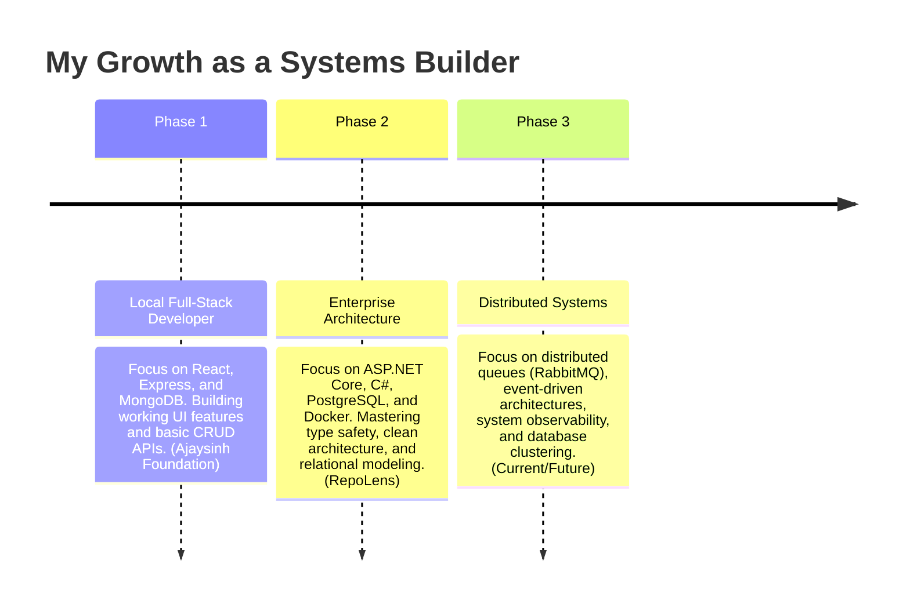

# My Engineering Roadmap

This document outlines my growth goals as a software systems builder. It maps out my path from building local full-stack web applications to designing high-performance distributed architectures.

---

## My Roadmap Timeline

---

## Detailed Roadmap Phases

### Phase 1: Local Full-Stack Developer (Completed)
*   **Focus**: Frontend routing, state managers, API controllers, and database CRUD collections.
*   **Key Projects**: **Ajaysinh Foundation** and **SmartFood**.
*   **Milestones**: Integrating third-party APIs (Razorpay), designing relational-like mock databases using MongoDB references, and writing client-side forms.

### Phase 2: Enterprise Architecture (Completed / Active)
*   **Focus**: Strict type systems, modular clean architecture, relational database indexing, and containerization.
*   **Key Projects**: **RepoLens** and **CogniTrace**.
*   **Milestones**: Building backends in ASP.NET Core, writing recursive CTE database queries in PostgreSQL, optimizing memory allocations using C# Tasks, and Dockerizing local development environments to prevent drift.

### Phase 3: Distributed Systems (Current & Future)
*   **Focus**: Event-driven services, message brokers, system tracing, and query scale performance.
*   **Goal Projects**: Distributed Rate Limiters, Event-Driven transaction workers.
*   **Skills to Gain**: Configuring RabbitMQ message exchanges, setting up OpenTelemetry for request tracing, and tuning PostgreSQL write pools.
