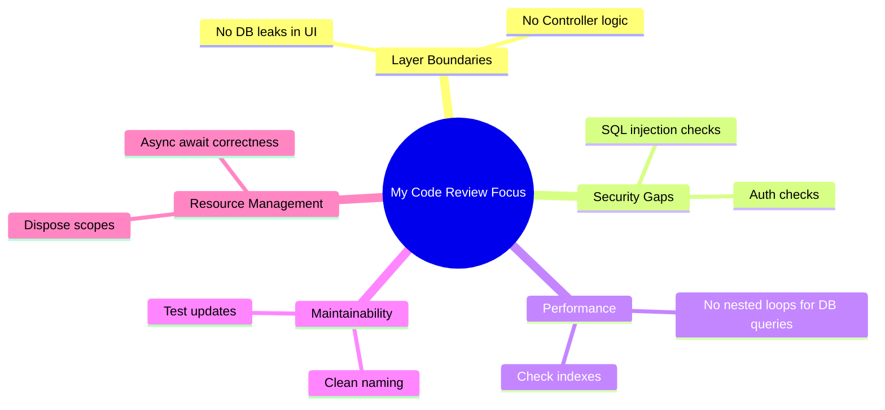

# How I Review Code

This document outlines my standard operating procedure (SOP) for conducting code reviews. The goal of this framework is to maintain code quality, verify security, prevent performance regressions, and ensure architectural consistency.

---

## My Code Review Checklist

When I review a pull request, I focus on five areas:



---

## 1. Checking Layer Boundaries

I verify that changes conform to clean architecture boundaries.
*   **The Trap**: Code that queries database contexts directly inside UI views or API controllers.
*   **What I Look For**: I ensure that data entities are mapped to specific mappers or DTOs before leaving the infrastructure layer. Controllers should remain simple routing coordinators, not database access engines.

---

## 2. Searching for Security Gaps

I look for common security vulnerabilities:

*   **Role Validation Checks**: If an API endpoint is secure, I verify it contains explicit authorization attributes (e.g., C# `[Authorize(Roles = "Admin")]` or Node.js auth route middleware). I check that the code retrieves user identities from the secure token claims context, not raw request parameters.
*   **SQL Parameterization**: I reject any code that uses string interpolation to build SQL queries, ensuring parameters are parameterized:
    ```csharp
    // REJECT: SQL Injection vulnerability
    var query = $"SELECT * FROM Commits WHERE Author = '{input}'";
    
    // ACCEPT: Parameterized query
    var query = "SELECT * FROM Commits WHERE Author = @Author";
    ```
*   **Input Sanitization**: I ensure all user-provided strings are sanitized, validated, and character-limited to prevent Cross-Site Scripting (XSS) and buffer bloat attacks.

---

## 3. Profiling Performance Bottlenecks

I search for code patterns that will degrade under production scale:

*   **The N+1 Query Loop**: I audit all database queries inside loops. If a service queries a database inside a loop, I reject it and require the developer to batch load the data or use eager loading (e.g., `.Include()` in EF Core).
*   **Missing Database Indexes**: If a PR adds queries using a new `WHERE` filter or a new `JOIN` condition, I ask the author: *"Is there an index on this field? If not, please provide the migration script to add it."*
*   **Non-Blocking Operations**: I ensure all async methods are awaited correctly. I check for blocking calls (like calling `.Result` or `.Wait()` on C# tasks, or synchronous file-system tasks in Node.js) and reject them.

---

## 4. Verifying Maintainability & Resource Management

*   **Clean Naming**: Variable and method names must describe their purpose clearly. I reject generic abbreviations (like `temp`, `data`, `info`, or `idx`).
*   **Resource Disposals**: I verify that database connections, file streams, and memory readers are closed correctly. In C#, I ensure they are wrapped inside `using` statements or declarations:
    ```csharp
    // Ensures file handles are closed even if an exception occurs
    using var reader = new StreamReader(filePath);
    ```
*   **Test Updates**: I check that new features or critical bug fixes are accompanied by unit or integration tests covering edge cases.
