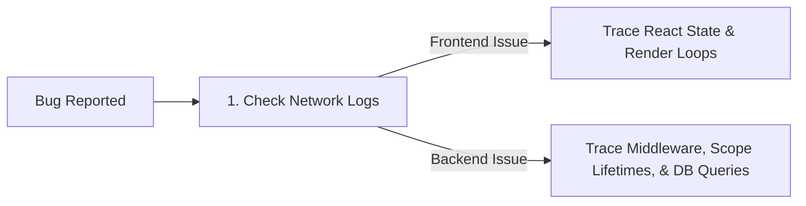

# My Debugging Workflows

When code fails, guessing is not a strategy. This document outlines my systematic processes for isolating, diagnosing, and fixing bugs across my application stacks, based on issues I have resolved in my own projects.

---

## My Diagnostics Mental Model

I diagnose bugs by isolating components:



---

## 1. Frontend Diagnostics (React Stack)

### Troubleshooting React Re-render Loops
*   **The Problem**: A component freezes the browser tab or loops indefinitely.
*   **My Workflow**:
    1.  I open **React Developer Tools** in Chrome and record a profiling session.
    2.  I inspect the render timeline to see which component is updating repeatedly.
    3.  I check the dependency array of my `useEffect` hooks. A common mistake I make is passing object or array references directly:
        ```javascript
        // TRAP: Triggers a re-render loop because arrays have different references every render
        useEffect(() => {
            fetchData();
        }, [myArray]);
        ```
    4.  I wrap the dependency in a reference hook or destructure it to primitive values (`[myArray.length]`) to stabilize the dependency array.

### Debugging Silent Token Expirations
*   **The Problem**: Users are logged out in the middle of completing a donation form on the NGO Platform.
*   **My Workflow**:
    1.  I open the network tab and look for API requests returning `401 Unauthorized`.
    2.  I verify the token expiration claim (`exp`) by parsing the token payload locally in application logs.
    3.  I verify that my axios interceptors are catching the token expiration error and requesting a new access token via the `/refresh` endpoint, rather than failing silently.

---

## 2. Backend & Database Diagnostics

### Tracking Dependency Injection Scope Errors (ASP.NET Core)
*   **The Problem**: The application crashes on startup with an `InvalidOperationException` stating that a scoped service cannot be resolved from a singleton.
*   **My Workflow**:
    1.  I locate the class throwing the exception.
    2.  I check its lifetime registration in `Program.cs`. 
    3.  If a class is registered as a `Singleton` (e.g., a background worker) but injects a `Scoped` dependency (like `DbContext`), I refactor the code. I resolve the scoped database context dynamically using `IServiceScopeFactory` to prevent connection leaks (captive dependencies).

### Finding Long-Running Database Scans & Locks (PostgreSQL)
*   **The Problem**: API write requests fail with timeouts or latency spikes.
*   **My Workflow**:
    1.  I check database locks and active queries using:
        ```sql
        SELECT pid, age(clock_timestamp(), query_start), query, state 
        FROM pg_stat_activity 
        WHERE state != 'idle';
        ```
    2.  Once I locate the slow query, I run it with `EXPLAIN (ANALYZE, BUFFERS)` to view the database planner's execution steps.
    3.  I look for `Seq Scan` (Sequential Scan) on large tables. If found, I write a matching composite index to turn the table scan into a fast index search.

---

## 3. Authentication & CORS Diagnostics

### CORS Blocks
*   **The Problem**: Browser blocks requests showing: `Access-Control-Allow-Origin header is missing...`
*   **My Workflow**:
    1.  I inspect the HTTP headers in the network tab. I check the value of the `Origin` header.
    2.  I verify that my backend CORS middleware is configured to accept that specific origin.
    3.  In ASP.NET Core, a common mistake I make is registering CORS after the authentication middleware. I ensure `app.UseCors()` is called **before** `app.UseAuthentication()` and `app.UseAuthorization()`.

---

## 4. Production Diagnostics

When debugging applications in production, I follow these principles:

1.  **Read Correlation IDs**: I assign a unique `CorrelationId` header to every incoming API request at the ingress layer. This ID is passed to all downstream logs, allowing me to trace the full lifecycle of a failed request.
2.  **Structured Log Filters**: I write structured JSON logs (using Serilog or Winston). In production, I filter by `LogLevel = Error` and correlate logs by `CorrelationId` to isolate database latency from application execution errors.
