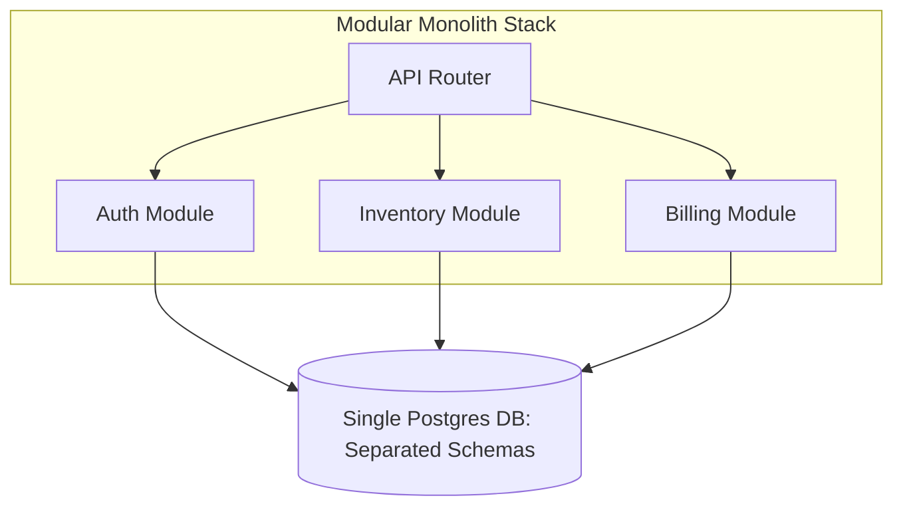

# My System Design Thinking

This document outlines how I approach system design, evaluate architectural trade-offs, and design database structures. I do not follow architectural buzzwords; I follow frameworks that keep systems simple, testable, and maintainable.

---

## 1. Domain-Driven Design (DDD) Boundaries

To design applications, I map domain boundaries before writing code. I use DDD to identify where code complexity should live.

### Bounded Contexts as System Boundaries
A single concept (like a `User`) changes meaning depending on where it is in the system.
*   *My Framework*: I do not share a single database model across all layers of my application.
    *   In the **Auth Context**, a user represents credentials, salts, and roles.
    *   In the **Inventory Context** (for **SmartFood**), the user is only an ID linked to purchase logs.
    *   In the **Telemetry Context** (for **CogniTrace**), the user represents mouse trace vectors.
*   *Action*: I separate these models and use translation mappers (DTO mapping) to pass data between bounded contexts. This prevents changes in one domain from breaking other systems.

### Aggregate Roots: Guarding System State
I identify **Aggregate Roots** to prevent database corruption. An Aggregate Root is the single entry point for updating a group of related data models.
*   *Example*: An `Order` contains a list of `OrderItems`. I never allow direct updates to an `OrderItem` database table. All updates (adding items, changing quantities) must go through the parent `Order` class, which validates business rules (e.g., checking if the order is already locked or paid) before updating the children.

---

## 2. Evaluating Trade-offs: Latency vs. Consistency

Every system design decision is a trade-off. Here is how I evaluate them in my projects:

### Case 1: Ingestion Latency vs. Data Durability (CogniTrace)
*   **The Conflict**: In **CogniTrace**, user mouse movement coordinates are sent to the server every few milliseconds.
    *   *Option A (High Durability)*: Write every coordinate packet to MongoDB immediately, ensuring no data is lost. (API latency spikes due to database lock queues).
    *   *Option B (Low Latency - Chosen)*: Buffer coordinates in web server memory, flushing them in batches to MongoDB every 5 seconds.
*   **My Trade-off Evaluation**: If a web server crashes, we lose 5 seconds of mouse trajectories—a minor loss that does not compromise overall security. I trade absolute durability for API responsiveness.

### Case 2: Read Speed vs. Data Normalization (SmartFood)
*   **The Conflict**: Calculating inventory levels requires scanning all transaction histories.
    *   *Option A (Normalized)*: Scan the transaction table and aggregate sum dynamically on every read request. (Ensures consistency, but read performance degrades as transaction volume increases).
    *   *Option B (Denormalized - Chosen)*: Maintain a cached `CurrentStock` count on the product table and update it using database triggers or service transactions.
*   **My Trade-off Evaluation**: Users check stock levels continuously, but stock write operations occur only during updates. I chose to optimize read speed by accepting the complexity of managing a cached stock value.

---

## 3. Designing for Scale without Complexity

I do not jump to microservices. Instead, I write **Modular Monoliths**.

*   **Modular Monolith**: Code is separated into distinct folders (modules) by business capability (e.g., Auth, Catalog, Billing). Modules can only communicate with each other through public interfaces, not by querying each other's databases directly.
*   **Why this works**: It keeps code clean, allows a single database setup, and avoids network latency. If one module ever needs to scale independently, it can be extracted into a microservice without rewriting the rest of the application.
