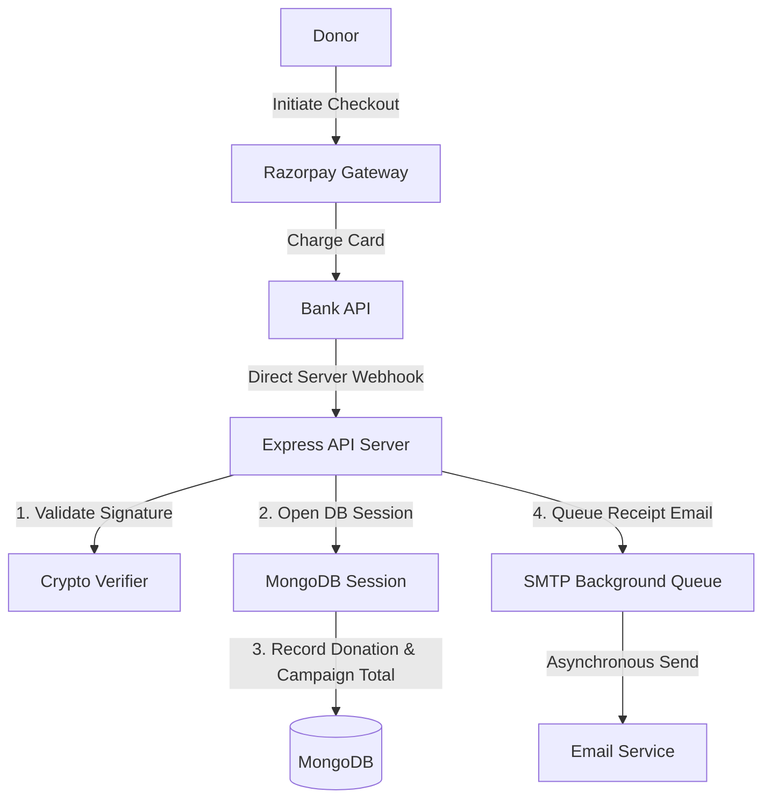

# Ajaysinh Foundation: Founder's Letter & Retrospective

## Why I Built It
I built the **Ajaysinh Foundation NGO Platform** to modernize the operations of a non-profit organization. The NGO had a manual fundraising workflow, making it difficult to collect donations, manage volunteer registrations, and track campaign allocations. I wanted to build a secure web portal that automates public contributions via Razorpay, simplifies volunteer coordination, and increases financial transparency.

---

## Initial Assumptions
*   **Assumption 1**: Processing payments in the browser checkout SDK was sufficient to guarantee donation logs.
*   **Assumption 2**: Sending email receipts synchronously during the checkout redirection page was reliable enough.
*   **Assumption 3**: Simple MongoDB updates across campaign and donation tables would never fail midway.

---

## Wrong Assumptions
*   **Browser redirection is unreliable**: Users frequently closed the checkout window before the browser could redirect to our success URL. This resulted in cases where users were charged but our database failed to log the donation.
*   **Synchronous email calls block request cycles**: Connecting to external SMTP servers during HTTP response cycles resulted in timeouts, blocking the checkout flow for users on slow connections.
*   **Dual writes without transactions create orphan states**: Updating campaign totals and donation lists in separate, non-transactional calls created inconsistencies when the server crashed midway.

---

## Architecture Evolution

To resolve these reliability and security issues, I evolved the backend architecture:
1.  **Server-to-Server Webhooks**: I decoupled checkout completion from client-side redirections. I implemented **cryptographically verified Razorpay webhooks**. The payment is processed backend-to-backend, ensuring no donation log is ever lost.
2.  **MongoDB Database Sessions**: I wrapped campaign updates and donation records in **MongoDB sessions and transactions**, guaranteeing that either both updates succeed or the transaction rolls back completely.
3.  **Background Mailer Queue**: I moved transactional email receipts out of the HTTP request loop and into an asynchronous queue, preventing email server latency from blocking the user's checkout experience.

---

## The Biggest Engineering Challenge: Payment Integrity
The biggest challenge was ensuring payment integrity in an asynchronous network. A payment cycle involves the client browser, our backend server, the payment gateway (Razorpay), and banking networks. I had to learn how to implement cryptographic signature validation on webhook payloads, manage database transactions under race conditions, and structure idempotent database updates.

---

## The Most Frustrating Bug
**The Double-Credited Campaign**: During early testing of the Razorpay webhook, network delays caused Razorpay to retry the webhook request three times. Because my payment handler was not idempotent, it processed all three retries, crediting the campaign three times for a single donation. I resolved this by adding a unique transaction index to the campaign logs and checking for existing records before processing webhook events.

---

## What I Would Redesign
If I rebuilt this system today, I would use **TypeScript** instead of plain JavaScript on the backend. Writing Express routes without typed schemas was a source of runtime validation errors. Adding TypeScript would catch interface and payload mismatches during compilation.

---

## Technical Debt I Knowingly Accepted
*   **SMTP Email Delivery**: I rely on a basic SMTP relay provider rather than integration with specialized email transaction APIs (like AWS SES). This exposes receipts to occasional delivery delays.
*   **Coupled Admin Panel**: The volunteer and campaign admin panels are built directly into the main React SPA, rather than being hosted as a separate application, increasing the bundle size for public visitors.

---

## What the Project Taught Me
The NGO Platform was my first production application with real users and real transactions. It taught me that in production, **reliability is a feature**. I learned about webhooks, database transactions, cryptographic safety, and how to write reliable software that handles network failures.
