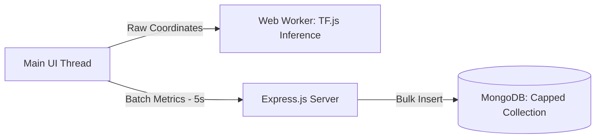

# CogniTrace: Founder's Letter & Retrospective

## Why I Built It
I built **CogniTrace** to address a growing security threat: Account Takeover (ATO) attacks. Traditional authentication (passwords, MFA) only verifies identity at the moment of login. I wanted to build a security dashboard that continuously verifies the user's identity based on their behaviors (keystroke dynamics, mouse paths, typing speed) using client-side machine learning.

---

## Initial Assumptions
*   **Assumption 1**: Collecting mouse movement coordinates in real-time would not impact browser performance.
*   **Assumption 2**: Training and running TensorFlow.js models directly in the browser's main thread would be lightweight.
*   **Assumption 3**: Storing raw coordinate logs in MongoDB would scale without specialized storage limits.

---

## Wrong Assumptions
*   **Mouse event tracking is resource-intensive**: Polling mouse paths at high frequencies (100 events/second) quickly filled browser memory arrays, slowing down the DOM rendering.
*   **TensorFlow.js blocks the UI**: Running machine learning predictions on the main thread froze the browser screen for a few frames, creating visible lag.
*   **MongoDB database bloat**: Storing raw coordinate arrays for every mouse movement generated gigabytes of data within days. I learned that databases need strict data retention limits.

---

## Architecture Evolution

Initially, the client tracked mouse movements and sent every coordinate to the backend API via HTTPS `POST` requests. Under load, this crashed the Node.js API servers.

I redesigned the pipeline:
1.  **Web Workers**: I moved the client-side TensorFlow.js model execution off the main browser thread and into a dedicated Web Worker thread.
2.  **Telemetry Aggregation**: I wrote an in-memory accumulator on the client. It collects coordinates, packages them into structured metrics (e.g., velocity vectors, acceleration profiles), and sends them to the server every 5 seconds.
3.  **Capped Databases**: I configured MongoDB capped collections with automatic Time-to-Live (TTL) indexes to automatically expire telemetry records after 14 days.

---

## The Biggest Engineering Challenge: Main-Thread UI Lag
The biggest challenge was offloading compute-heavy calculations from the single-threaded JavaScript environment in the browser. When a user typed or moved their mouse, the browser had to render the UI, collect telemetry, and execute the TensorFlow.js models. Offloading the ML model execution to Web Workers was the breakthrough that kept the interface rendering at 60 FPS.

---

## The Most Frustrating Bug
**The Telemetry Race Condition**: During user logins, the client initiated telemetry collection before the JWT token was successfully saved to browser memory. This caused the first few telemetry packets to be sent with missing auth headers, triggering a cascade of `401 Unauthorized` errors in the logs. I resolved this by wrapping telemetry collection in a promise chain that waits for authentication success.

---

## What I Would Redesign
If I rebuilt CogniTrace today, I would use **WebSockets (Socket.io)** for streaming telemetry instead of HTTP batch requests. WebSockets maintain a single open connection, reducing the header overhead and request serialization delays of multiple HTTP calls.

---

## Technical Debt I Knowingly Accepted
*   **Telemetry Data Loss**: By batching coordinates on the client, if the user closes their browser window in the middle of a batch, those 5 seconds of telemetry data are lost. I accepted this loss to protect server performance.
*   **Static Anomaly Models**: The machine learning model is trained offline. The client runs static predictions without real-time model updates.

---

## What the Project Taught Me
CogniTrace taught me how to manage client-side performance under high data loads. I learned about Web Workers, browser rendering cycles, and how to write asynchronous telemetry streams in Node.js. It forced me to think about security, JWT storage safety, and database optimization.
