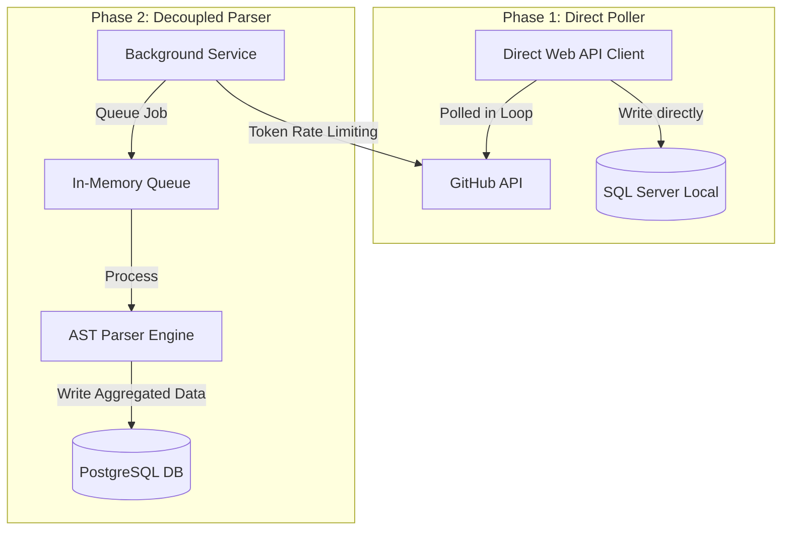

# RepoLens: Founder's Letter & Retrospective

## Why I Built It
I built **RepoLens** because I wanted to solve a problem I encountered in my own repositories: understanding where code quality was deteriorating. I wanted a tool that would look at a repository, identify code smells, calculate cyclomatic complexity, analyze Git commit histories, and output a quantitative metric showing where technical debt was accumulating. 

---

## Initial Assumptions
*   **Assumption 1**: The GitHub API would be easy to poll continuously for code changes without hitting limits.
*   **Assumption 2**: Parsing Abstract Syntax Trees (ASTs) of files was a simple string scanning task.
*   **Assumption 3**: Storing all commit metadata directly in database relations was the cleanest way to query file changes.

---

## Wrong Assumptions
*   **The GitHub API is highly restrictive**: The moment I ran my sync background worker on large active repositories, I exhausted GitHub's 5,000 requests/hour API limit within minutes, causing sync failures.
*   **AST parsing is compute-heavy**: I learned that scanning files requires specialized tokenization libraries. In early iterations, parsing code trees in C# using standard string splits led to memory crashes.
*   **Relational tables grow quickly**: Storing every line change, file modification, and author reference in structured tables led to database size inflation, slowing down join queries.

---

## Architecture Evolution

Initially, the backend was a simple API client that queried GitHub and wrote records directly to local database tables. To scale, I redesigned the backend using **Clean Architecture** patterns in ASP.NET Core. I decoupled the GitHub fetch service, the AST parsing engine, and the database writer. I introduced background workers that read from rate-limited queues and wrote data in structured batches.

---

## The Biggest Engineering Challenge: Rate Limits & AST Parsing
To scan repositories, the background service downloads source files. 
1.  **Rate Limits**: I had to write an **Adaptive Polling Middleware** that tracks API headers (`X-RateLimit-Remaining` and `X-RateLimit-Reset`) and dynamically pauses threads to prevent token blocking.
2.  **AST Complexity**: I had to learn how to use syntax analyzers rather than regex to scan code. I integrated AST tree wrappers to parse syntax nodes recursively, which was a challenge to run concurrently without memory leaks.

---

## The Most Frustrating Bug
**The Orphan Commit Thread**: Commits are structured as graphs (commits can have parent commits). During early sync attempts, if a network error interrupted a commit batch write, subsequent imports created "orphan" commits that had missing parent relations. This broke my git churn history queries. I had to implement database-level transaction rollbacks and write recovery tasks to clean up incomplete commits before running audits.

---

## What I Would Redesign
If I rebuilt RepoLens today, I would separate the file parsing engine into a serverless function (AWS Lambda or Azure Functions). Instead of running CPU-intensive AST parsing on the web server (which blocks concurrent API requests), the background poller would upload file content to a serverless queue. The serverless function would execute the complexity check in an isolated context and return only the calculated metrics.

---

## Technical Debt I Knowingly Accepted
*   **Caching Aggregations**: Rather than calculating Technical Debt scores on every page load, I store pre-computed scores on the `Repository` table. If the database crashes, there is a risk the cache outpaces the transaction tables.
*   **Limited Language Support**: The AST parser only supports JavaScript, TypeScript, and C#. Adding languages like Python requires writing new parser wrappers.

---

## Trade-offs I Made
I traded raw write speed for transactional safety. During repository syncs, I run bulk inserts within database transactions. This limits how fast I can write data, but it prevents database corruption and incomplete commits.

---

## What the Project Taught Me
RepoLens taught me how to write clean code using interfaces and dependency injection. It forced me to think about query performance and learn database profiling. I gained a deep understanding of ASP.NET Core background tasks, C# tasks, and PostgreSQL query optimizations.
