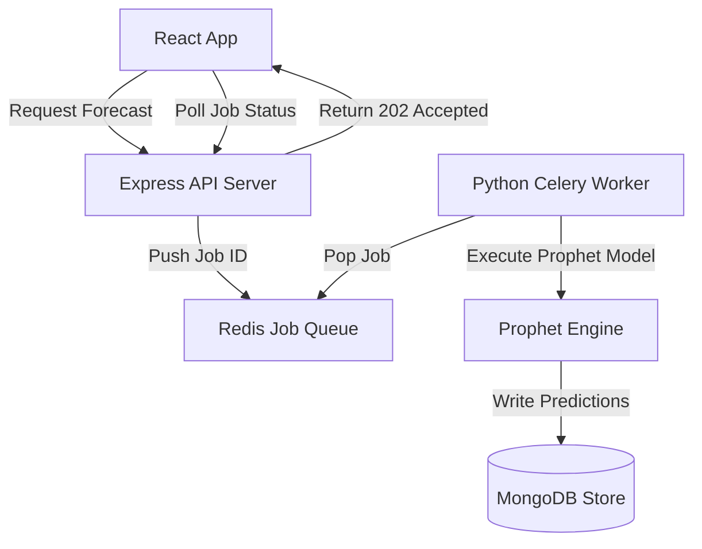

# SmartFood: Founder's Letter & Retrospective

## Why I Built It
I built **SmartFood** to address food waste in the retail food industry. Restaurants and food vendors struggle to forecast inventory requirements, resulting in excess purchasing and high food waste. I wanted to build an inventory optimization dashboard that tracks daily sales, logs waste patterns, and runs time-series predictions (Facebook Prophet & Random Forest) to generate automated ordering recommendations.

---

## Initial Assumptions
*   **Assumption 1**: I could execute the Python machine learning scripts directly inside the Node.js API server using child processes.
*   **Assumption 2**: Facebook Prophet would generate accurate forecasts even with limited historical data.
*   **Assumption 3**: Simple array filters in memory were sufficient to calculate stock quantities.

---

## Wrong Assumptions
*   **Synchronous processes block the server**: Running Python forecasting models in Node.js child processes was a disaster. The CPU-heavy Python execution blocked the Node event loop for 10-15 seconds, preventing the server from handling other API requests.
*   **Prophet overfits on sparse data**: I learned time-series forecasting requires months of consistent data. For new stores with sparse records, Prophet produced volatile, inaccurate forecasts.
*   **In-memory stock aggregation does not scale**: Querying thousands of inventory transaction documents and calculating stock counts in JavaScript memory led to API timeouts as data grew.

---

## Architecture Evolution

Initially, the API server ran Python scripts synchronously on demand. 
To fix this:
1.  **Asynchronous Job Queue**: I integrated a **Redis-backed background task queue**. The Node API registers a forecast request, immediately returns a `202 Accepted` status, and pushes the job to the queue.
2.  **Isolated ML Sidecar**: I moved the Python machine learning code into a separate containerized worker service. The worker processes tasks from the Redis queue, writes the predictions to MongoDB, and updates the task status.
3.  **Fallback Models**: I implemented a fallback system. If a product has less than 60 days of transaction data, the system bypasses Prophet and calculates a simple moving average before switching to Prophet as data accumulates.

---

## The Biggest Engineering Challenge: Decoupling Runtimes
The biggest challenge was building a reliable bridge between Node.js and Python. The two stacks have different memory footprints, package ecosystems, and execution patterns. Designing a clean messaging system using Redis queues to coordinate tasks asynchronously was a significant architectural milestone for me.

---

## The Most Frustrating Bug
**The Floating Precision Stock Discrepancy**: Due to floating-point rounding errors in JavaScript math, calculating aggregate stock quantities occasionally returned values like `14.000000000000004` instead of `14`. This caused validation guards to fail when validating inventory counts. I had to implement rounding wrappers and migrate calculation fields to database aggregation queries that run with fixed decimal structures.

---

## What I Would Redesign
If I rebuilt SmartFood today, I would use **PostgreSQL** instead of MongoDB. Managing inventory ledger transactions requires strict consistency across stock tables. Implementing financial-grade transaction ledgers is easier in SQL than managing document-level updates in MongoDB.

---

## Technical Debt I Knowingly Accepted
*   **Polling Instead of WebSockets**: The client polls the backend API to check if background forecasting jobs are complete, rather than using WebSockets to push status updates.
*   **Lack of Automated Model Retraining**: Machine learning models are retrained manually. I have not built an automated pipeline to retrain models on new sales records dynamically.

---

## What the Project Taught Me
SmartFood taught me how to coordinate asynchronous architectures and manage multi-container systems. I learned Python data structures, time-series forecasting trade-offs, and how to optimize write transactions.
