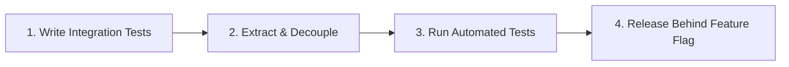

# My Technical Debt Framework

This document outlines how I identify, score, and systematically refactor technical debt. This framework is heavily inspired by the codebase auditing engine I built for **RepoLens**.

---

## 1. How I Classify Technical Debt

I do not treat technical debt as a generic issue. I categorize it into three areas to determine the path of resolution:

*   **Boundary Leakage (Architectural)**: Code that bypasses design layers (e.g., writing SQL queries directly inside React components or Web Controllers instead of resolving them through repository layers). This is high-risk debt because changes to database schemas can crash the frontend.
*   **Performance Degradation (Complexity)**: Highly nested loops, unindexed queries, or CPU-blocking code. This is low-risk in development but causes performance issues under production loads.
*   **Developer Friction (Cleanliness)**: Missing tests, undocumented APIs, inconsistent formatting, and duplicate blocks. This slows down development velocity but does not break systems directly.

---

## 2. Quantitative Scoring: The TDS Framework

To prevent subjective arguments about code quality, I use a metric called the **Technical Debt Score (TDS)**, which I developed while designing RepoLens. The TDS correlates code complexity with Git change frequency (churn) to prioritize which files should be refactored first.

### The TDS Formula

For any source file $f$:

$$\text{TDS}(f) = (\text{CC}(f) \times 0.5 + \text{CS}(f) \times 0.5) \times \text{Churn}(f)$$

Where:
*   **$\text{CC}(f)$ (Cyclomatic Complexity)**: The number of linearly independent paths through the file.
*   **$\text{CS}(f)$ (Code Smells)**: The count of structural issues identified by static analysis.
*   **$\text{Churn}(f)$**: The number of commits modifying file $f$ in the past 90 days.

### Why Churn Matters
If a file has high complexity ($\text{CC} = 50$) but has not been modified in the past year ($\text{Churn} = 0$), its TDS is 0. It is a stable legacy file. I leave it alone. However, if a file has moderate complexity ($\text{CC} = 15$) but is updated in every sprint ($\text{Churn} = 25$), its TDS spikes. This is a file that is actively changing, making it a priority for refactoring to prevent regressions.

---

## 3. How I Detect Technical Debt

I combine three automated checks:

1.  **Git Churn Audits**: I run the following command in my shell to find my most active files:
    ```bash
    git log --format=format: --name-only --since="90 days ago" | sort | uniq -c | sort -nr | head -n 10
    ```
2.  **Static Analysis Hooks**: I configure Roslyn Analyzers in C# and ESLint in React. These trigger compiler warnings during local builds if structural complexity limits are exceeded.
3.  **Vulnerability Scans**: I run `npm audit` or `dotnet list package --vulnerable` before every release to catch outdated, insecure dependencies.

---

## 4. My Refactoring Workflow

When refactoring files with a high TDS, I follow a strict process to avoid introducing regressions:



1.  **Write Integration Tests First**: Before changing a line of complex code, I write integration tests covering the existing behavior. I need a test baseline to verify my refactoring does not break legacy features.
2.  **Extract and Decouple**: I do not rewrite classes from scratch. I extract small helper methods. I replace inline dependencies with interface collaborators injected via dependency injection.
3.  **Test Iteratively**: I run my test suites after every small modification to isolate where potential bugs are introduced.
4.  **Release Behind Feature Flags**: If the refactored code handles critical business paths (e.g., payment logs on the NGO Platform), I deploy the new code behind a feature flag, allowing me to roll back to the stable legacy implementation if errors occur.
